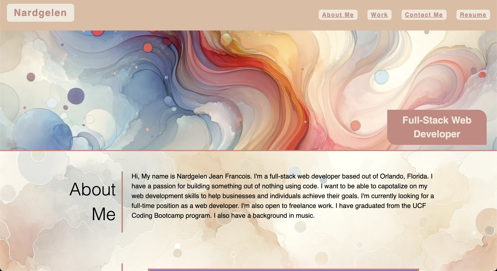

# Web Development Portfolio

## Description

A professional portfolio site for Nardgelen Jean Francois. This project showcases my journey and achievements as a web developer. I was motivated by the desire to showcase my skills through past work, I built this portfolio to connect with potential employers and clients. It addresses the need for a personal digital space to demonstrate my proficency with responsive web design. Through this process I have deepened my understanding of CSS, HTML, and responsive layouts.

## Installation 

Visit site at https://nardgie.github.io/portfolio/

## Usage

The UI of this portfolio site is designed to be intuitive and easy to navigate. Click on the desireded setion in the navigation bar that you wish to review, and the page will scroll to the selected section for you viewing pleasure. Navigate through sections about myself, my skills, projects, and professional background. Feel free to click on the links to my already deployed projects and try them for yourself!

```md

```
## Credits 

This project was independently built by Nardgelen Jean Francois 

## License

MIT License

Copyright (c) 2023 Nardgelen Jean Francois

Permission is hereby granted, free of charge, to any person obtaining a copy
of this software and associated documentation files (the "Software"), to deal
in the Software without restriction, including without limitation the rights
to use, copy, modify, merge, publish, distribute, sublicense, and/or sell
copies of the Software, and to permit persons to whom the Software is
furnished to do so, subject to the following conditions:

The above copyright notice and this permission notice shall be included in all
copies or substantial portions of the Software.

THE SOFTWARE IS PROVIDED "AS IS", WITHOUT WARRANTY OF ANY KIND, EXPRESS OR
IMPLIED, INCLUDING BUT NOT LIMITED TO THE WARRANTIES OF MERCHANTABILITY,
FITNESS FOR A PARTICULAR PURPOSE AND NONINFRINGEMENT. IN NO EVENT SHALL THE
AUTHORS OR COPYRIGHT HOLDERS BE LIABLE FOR ANY CLAIM, DAMAGES OR OTHER
LIABILITY, WHETHER IN AN ACTION OF CONTRACT, TORT OR OTHERWISE, ARISING FROM,
OUT OF OR IN CONNECTION WITH THE SOFTWARE OR THE USE OR OTHER DEALINGS IN THE
SOFTWARE.

--------

## Features

- Responsive design adapts to various screens
- Interactive project showcase with hover effects
- Seamless background patterns enhancing visual appeal